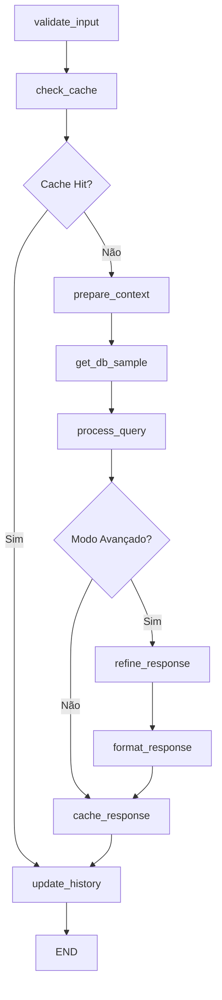

# AgentGraph - Arquitetura LangGraph

## 🏗️ Visão Geral

O AgentGraph foi completamente refatorado do LangChain para LangGraph, implementando uma arquitetura modular baseada em nós com processamento assíncrono e gerenciamento inteligente de objetos.

## 📁 Estrutura do Projeto

```
agentgraph/
├── app.py                     # Entry point: Gradio + LangGraph
├── graphs/
│   └── main_graph.py          # StateGraph principal
├── nodes/                     # Nós especializados
│   ├── csv_processing_node.py # Processamento genérico de CSV
│   ├── database_node.py       # Operações de banco de dados
│   ├── query_node.py          # Processamento de consultas
│   ├── refinement_node.py     # Refinamento de respostas
│   ├── cache_node.py          # Gerenciamento de cache
│   ├── agent_node.py          # Coordenação geral
│   └── custom_nodes.py        # Nós especializados
├── agents/
│   ├── sql_agent.py           # Criação do agente SQL
│   └── tools.py               # Ferramentas do agente
├── utils/
│   ├── database.py            # Funções de banco de dados
│   ├── config.py              # Configurações
│   └── object_manager.py      # Gerenciador de objetos não-serializáveis
├── uploaded_data/             # Arquivos CSV enviados
├── requirements.txt
├── README.md
├── ARCHITECTURE.md
└── .env
```

## 🔄 Fluxo do LangGraph

### Fluxo Principal de Consulta



### Nós Especializados

#### 1. **csv_processing_node.py**
- **Função**: Processamento genérico de CSV
- **Características**:
  - Detecção automática de separadores (`;`, `,`, `\t`, `|`)
  - Identificação inteligente de tipos de dados
  - Conversão robusta para SQL types
  - Estatísticas de processamento

#### 2. **database_node.py**
- **Função**: Operações de banco de dados
- **Características**:
  - Criação de banco a partir de DataFrame processado
  - Carregamento de banco existente
  - Obtenção de amostras de dados
  - Validação de integridade

#### 3. **query_node.py**
- **Função**: Processamento de consultas SQL
- **Características**:
  - Validação de entrada
  - Preparação de contexto
  - Execução via agente SQL
  - Tratamento de erros

#### 4. **refinement_node.py**
- **Função**: Refinamento de respostas
- **Características**:
  - Modo avançado com LLM adicional
  - Avaliação de qualidade
  - Formatação final
  - Adição de insights

#### 5. **cache_node.py**
- **Função**: Gerenciamento de cache e histórico
- **Características**:
  - Verificação de cache
  - Armazenamento de respostas
  - Atualização de histórico
  - Estatísticas de uso

## 🧠 Gerenciador de Objetos

### Problema Resolvido
O LangGraph requer que o estado seja serializável, mas objetos como SQLAgentManager, Engine e CacheManager não são serializáveis.

### Solução: ObjectManager
```python
# Armazena objetos não-serializáveis
agent_id = object_manager.store_sql_agent(sql_agent)
engine_id = object_manager.store_engine(engine)
cache_id = object_manager.store_cache_manager(cache_manager)

# Estado serializável
state = {
    "user_input": "query",
    "agent_id": agent_id,
    "engine_id": engine_id,
    "cache_id": cache_id
}

# Recupera objetos quando necessário
sql_agent = object_manager.get_sql_agent(agent_id)
```

## 📊 Processamento CSV Genérico

### Detecção Automática de Tipos

```python
# Detecta automaticamente:
- Datas: Tenta conversão com pd.to_datetime()
- Números inteiros: Verifica padrões numéricos
- Números decimais: Detecta pontos/vírgulas
- Texto: Mantém como string

# Regras de processamento:
- parse_dates: Para colunas de data
- convert_to_int: Para números inteiros
- convert_to_float: Para números decimais
- convert_text_to_int/float: Para texto numérico
- keep_as_text: Para texto puro
```

### Separadores Suportados
- `;` (ponto e vírgula)
- `,` (vírgula)
- `\t` (tab)
- `|` (pipe)

## 🔧 Configurações

### Arquivo .env
```env
# API Keys
HUGGINGFACE_API_KEY=your_key_here
OPENAI_API_KEY=your_key_here

# Database Configuration
SQL_DB_PATH=data.db
DEFAULT_CSV_PATH=tabela.csv
UPLOAD_DIR=uploaded_data

# Model Configuration
DEFAULT_MODEL=LLaMA 70B
MAX_ITERATIONS=40
TEMPERATURE=0

# Gradio Configuration
GRADIO_SHARE=False
GRADIO_PORT=7860
```

## 🚀 Funcionalidades

### ✅ Mantidas do Código Original
- Múltiplos modelos LLM (LLaMA 70B, 8B, Qwen 32B)
- Upload de CSV personalizado
- Sistema de cache inteligente
- Modo avançado com refinamento
- Histórico de conversas
- Interface Gradio moderna
- Reset do sistema

### ✅ Novas Funcionalidades
- Processamento genérico de CSV
- Arquitetura modular de nós
- Gerenciamento de objetos não-serializáveis
- Fluxo condicional otimizado
- Validação automática de sistema
- Detecção automática de portas
- Logs estruturados

## 🧪 Testes

### Arquivo de Teste
```bash
python test_new_architecture.py
```

Testa individualmente:
- Processamento CSV
- Criação de banco
- Agente SQL
- Gerenciador de objetos
- Amostra de dados

## 🔄 Deploy

### Local
```bash
python app.py
```

### HuggingFace Spaces
1. Configure as variáveis de ambiente
2. Faça upload dos arquivos
3. O sistema detectará automaticamente a porta disponível

## 📈 Benefícios da Nova Arquitetura

1. **Escalabilidade**: Fácil adição de novos nós
2. **Manutenibilidade**: Código organizado e modular
3. **Robustez**: Sem problemas de serialização
4. **Flexibilidade**: Processamento genérico de dados
5. **Performance**: Fluxo otimizado com cache
6. **Debugging**: Logs detalhados por nó
7. **Testabilidade**: Nós independentes testáveis

## 🔍 Monitoramento

### Logs Estruturados
```
[VALIDATION] - Validação de entrada
[CACHE] - Operações de cache
[CONTEXT] - Preparação de contexto
[DATABASE] - Operações de banco
[QUERY] - Processamento de consultas
[REFINE] - Refinamento de respostas
[HISTORY] - Atualização de histórico
```

### Estatísticas
- Tempo de execução por nó
- Taxa de acerto do cache
- Estatísticas de processamento CSV
- Validação de componentes
