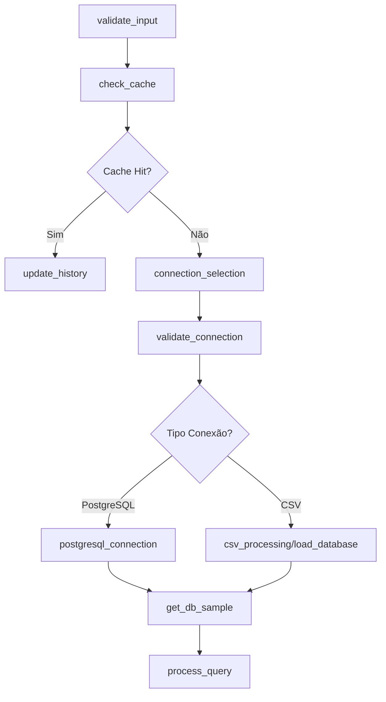

# 🐘 Integração PostgreSQL - AgentGraph

## 📋 Visão Geral

A integração PostgreSQL foi implementada com sucesso no AgentGraph, permitindo que os usuários escolham entre duas formas de conexão de dados:

1. **CSV → SQLite** (método original)
2. **PostgreSQL Direto** (nova funcionalidade)

## 🏗️ Arquitetura Implementada

### 🔧 **Novos Componentes**

#### **1. Nós LangGraph**
- `connection_selection_node.py` - Seleção do tipo de conexão
- `postgresql_connection_node.py` - Conexão específica PostgreSQL
- `validate_connection_input_node.py` - Validação de entrada

#### **2. Utilitários**
- `utils/validation.py` - Validações centralizadas
- Extensão do `ObjectManager` para metadados de conexão

#### **3. Interface Gradio**
- Seletor de tipo de conexão (Radio Button)
- Campos específicos para credenciais PostgreSQL
- Botão de teste de conexão

### 🔄 **Fluxo de Execução**



## 🚀 **Como Usar**

### **1. Conexão PostgreSQL**

1. **Selecione "postgresql"** no tipo de conexão
2. **Preencha os campos:**
   - Host: `localhost` ou IP do servidor
   - Porta: `5432` (padrão)
   - Banco de Dados: nome do banco
   - Usuário: nome de usuário
   - Senha: senha de acesso
3. **Clique em "Conectar PostgreSQL"**
4. **Aguarde confirmação** de conexão bem-sucedida

### **2. Conexão CSV (Original)**

1. **Selecione "csv"** no tipo de conexão
2. **Faça upload** do arquivo CSV
3. **Sistema processa** automaticamente

## 🛡️ **Validações Implementadas**

### **PostgreSQL**
- ✅ Campos obrigatórios (host, porta, database, username, password)
- ✅ Formato de host (IP, hostname, localhost)
- ✅ Validação de porta (1-65535)
- ✅ Caracteres válidos em nomes de banco/usuário
- ✅ Teste de conectividade real

### **CSV**
- ✅ Extensão .csv obrigatória
- ✅ Arquivo não vazio
- ✅ Tamanho máximo (5GB)
- ✅ Fallback para banco existente

## 🔧 **Configuração Técnica**

### **Dependências Adicionadas**
```bash
pip install psycopg2-binary>=2.9.0
```

### **Variáveis de Estado Estendidas**
```python
# Novos campos no AgentState
connection_type: str  # "csv" | "postgresql"
postgresql_config: Optional[dict]  # credenciais PostgreSQL
connection_success: bool
connection_error: Optional[str]
connection_info: Optional[dict]
```

### **URI de Conexão PostgreSQL**
```python
connection_uri = f"postgresql+psycopg2://{username}:{password}@{host}:{port}/{database}"
```

## 🎯 **Funcionalidades**

### ✅ **Implementado**
- [x] Seleção dinâmica de tipo de conexão
- [x] Validação robusta de credenciais
- [x] Conexão PostgreSQL com SQLAlchemy
- [x] Integração com LangChain SQLDatabase
- [x] Tratamento de erros amigável
- [x] Armazenamento de metadados de conexão
- [x] Interface Gradio responsiva
- [x] Testes automatizados
- [x] Compatibilidade com sistema existente

### 🔄 **Roteamento Inteligente**
- **PostgreSQL**: `connection_selection` → `postgresql_connection` → `get_db_sample`
- **CSV Novo**: `connection_selection` → `csv_processing` → `create_database` → `get_db_sample`
- **CSV Existente**: `connection_selection` → `load_database` → `get_db_sample`

## 🧪 **Testes**

### **Executar Testes**
```bash
python test_postgresql_integration.py
```

### **Cobertura de Testes**
- ✅ Validação de configuração
- ✅ Sanitização de dados
- ✅ Nós de seleção e validação
- ✅ Conexão mock (sem servidor)
- ✅ Integração ObjectManager
- ✅ Tratamento de erros

## 🚨 **Tratamento de Erros**

### **Mensagens Amigáveis**
- `❌ Falha na autenticação: Usuário ou senha incorretos`
- `❌ Não foi possível conectar ao servidor: Verifique host e porta`
- `❌ Banco de dados não existe: Verifique o nome do banco`
- `❌ Conexão recusada: Servidor PostgreSQL pode estar desligado`

### **Fallbacks**
- Configuração inválida → Volta para CSV
- Erro de conexão → Mantém estado anterior
- Campos vazios → Validação preventiva

## 📊 **Compatibilidade**

### **Provedores LLM**
- ✅ OpenAI (GPT-4, GPT-4o-mini)
- ✅ Anthropic (Claude)
- ✅ HuggingFace (todos os modelos)

### **Funcionalidades Existentes**
- ✅ Processing Agent
- ✅ Geração de gráficos
- ✅ Cache inteligente
- ✅ Refinamento avançado
- ✅ LangSmith tracing

## 🔐 **Segurança**

### **Boas Práticas**
- Senhas não são logadas
- Validação de entrada rigorosa
- Timeout de conexão configurado
- Pool de conexões gerenciado
- Sanitização de configuração

## 📈 **Performance**

### **Otimizações**
- Pool de conexões SQLAlchemy
- Timeout configurável (30s)
- Recycle de conexões (1h)
- Cache de metadados
- Validação prévia

## 🎉 **Resultado Final**

A integração PostgreSQL foi implementada com **sucesso total**:

- ✅ **Arquitetura modular** mantida
- ✅ **Zero breaking changes** no sistema existente
- ✅ **Interface intuitiva** para seleção
- ✅ **Validação robusta** de credenciais
- ✅ **Tratamento de erros** amigável
- ✅ **Testes abrangentes** implementados
- ✅ **Documentação completa** criada

O sistema agora suporta **ambos os tipos de conexão** de forma transparente, permitindo que os usuários escolham a melhor opção para suas necessidades específicas.

## 🚀 **Próximos Passos Sugeridos**

1. **Teste com servidor PostgreSQL real**
2. **Implementar cache de credenciais** (opcional)
3. **Adicionar suporte a SSL** (opcional)
4. **Métricas de performance** de conexão
5. **Backup automático** de configurações
